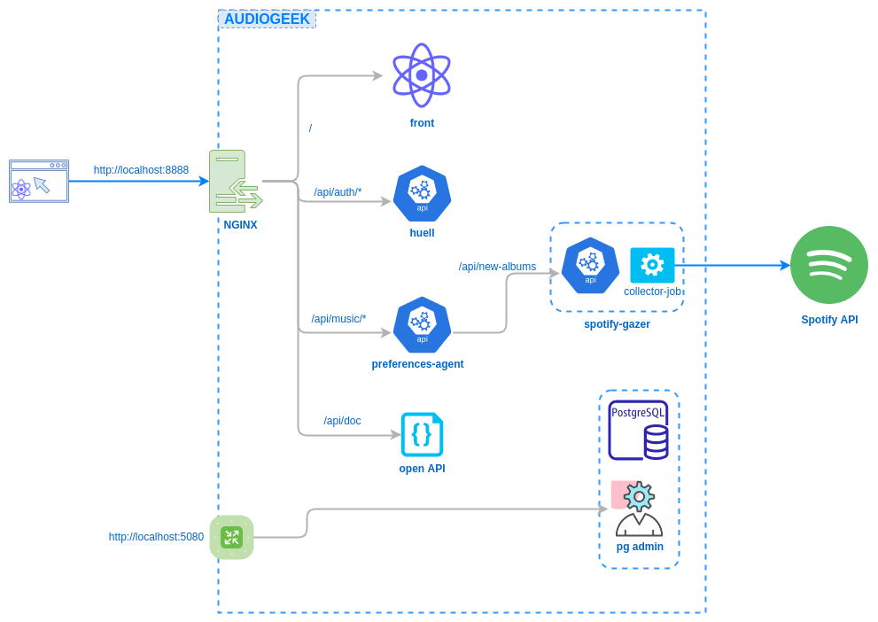

# AudioGEEK


## Docker deployment



## Docker composes
### services.yml

**Purpose**\
services.yml contains database services (postgres, pgadmin) for development usage.

**How to use**\
To start services.yml, you need to be in repo folder in terminal. Then just simply type:
```
docker-compose -f services.yml up
```
Next you can go to `localhost:5480` to manage database via pgadmin.

**Default database credentials**
* PGADMIN email - codebusters@ironhills.dev
* PGADMIN password - postgres
* POSTGRES host - `localhost:5432` for your computer or `audiogeek-postgres:5432` for pgadmin
* POSTGRES username - audiogeek
* POSTGRES password - audiogeek


